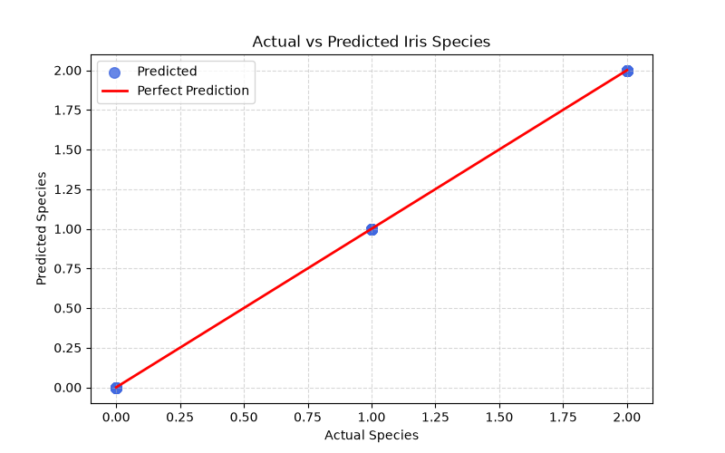
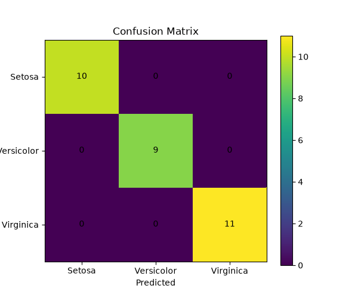
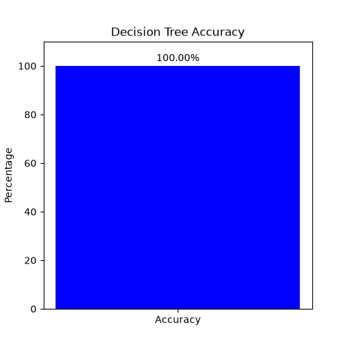

# 🌸 Iris Flower Classification using Machine Learning

## 📌 Project Overview

This project builds a Machine Learning classification model to identify the species of Iris flowers based on their flower measurements. The model is trained using the Decision Tree Classification algorithm and predicts whether a flower belongs to Setosa, Versicolor, or Virginica.

The project demonstrates the complete machine learning workflow, including data preprocessing, model training, prediction, performance evaluation, and visualization.

---

## 📂 Dataset

The dataset contains the following features:

- Sepal Length (cm)
- Sepal Width (cm)
- Petal Length (cm)
- Petal Width (cm)
- Species (Target Variable)

---

## 🛠 Technologies & Libraries Used

- Python
- Pandas
- NumPy
- Matplotlib
- Scikit-learn

---

## 🤖 Machine Learning Concepts Used

- Data Loading
- Data Preprocessing
- Feature Selection
- Label Encoding
- Train-Test Split
- Decision Tree Classification
- Model Prediction
- Accuracy Score
- Classification Report
- Confusion Matrix
- Data Visualization

---

## ⚙️ Project Workflow

1. Load the Iris dataset
2. Remove unnecessary columns
3. Encode target labels
4. Split the dataset into training and testing sets
5. Train the Decision Tree classifier
6. Predict flower species
7. Evaluate model performance
8. Visualize the results

---

## 📊 Project Visualizations

### 🌸 Actual vs Predicted Iris Classification



Compares the actual flower species with the predicted species generated by the Decision Tree model.

---

### 🔥 Confusion Matrix



Displays the number of correct and incorrect predictions for each Iris species.

---

### 📈 Predicted Species Distribution


Shows the number of flowers predicted for each Iris species.

---

### 🎯 Decision Tree Accuracy



Represents the overall classification accuracy achieved by the model.

---

## 📈 Model Evaluation

The model is evaluated using:

- Accuracy Score
- Classification Report
- Confusion Matrix

---

## ▶️ How to Run

### Install the required libraries

```bash
pip install -r requirements.txt
```

### Run the project

```bash
python iris_flower_classification.py
```

---

## 📁 Project Structure

```
Iris_Flower_Classification/
│
├── Iris.csv
├── iris_flower_classification.py
├── README.md
├── requirements.txt
├── Actual_vs_Predicted_Iris.png
├── Confusion_Matrix.png
├── Predicted_Species_Distribution.png
└── Accuracy.png
```

---

## 🎯 Conclusion

The Decision Tree classifier successfully classifies Iris flowers into Setosa, Versicolor, and Virginica with high accuracy. The project demonstrates the complete machine learning pipeline, including preprocessing, model training, prediction, evaluation, and visualization.

---

## 👨‍💻 Author

**Aman Tyagi**